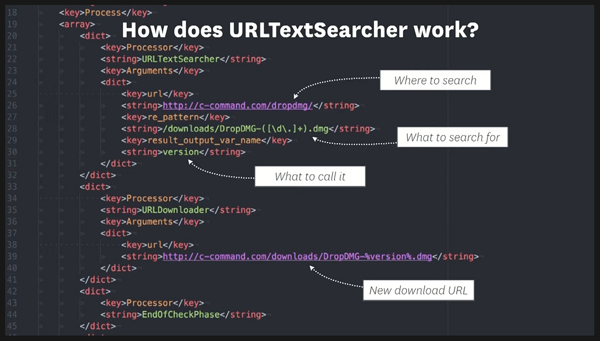

# AutoPKG Download and Package Recipes
Learning as I go. Please be gentle.
A repo for recipes I can't find elsewhere. Mostly taken from others' work, but written worselyer ;-) and not enough attribution given. My apologies. If you see your code, please let me know so I can credit you.

# My notes
## How to use URLTextSearcher Processor
In use by mural and WireShark download recipes


## Using Charles Proxy to get Download URLs
[Ben Toms (MacMule) presentation](https://www.youtube.com/watch?v=yTkgrCUoxDM)

## Processor JamfMacAppUploader
Investigate

## plistyamlplist
XML recipes to YAML.
https://github.com/grahampugh/plist-yaml-plist

### ERROR AS OF JANUARY 2024
There eems to be an issue with ruaml.yaml 0.18 and above. 0.18.0 runs, but fails silently, 0.18.1 and above errors as you are seeing.
Workaround is uninstall any 0.18 version and and install 0.17.40.
```
python3 -m pip uninstall ruamel.yaml  
python3 -m pip install -U ruamel.yaml==0.17.40 --user
```
# Links
[autopkg](https://github.com/autopkg/)
[jamf-uploader](https://github.com/grahampugh/jamf-upload)
[Noteworthy autopkg processors](https://github.com/autopkg/autopkg/wiki/Noteworthy-Processors)


# Thanks
Would never have got this far without MacAdmins Slack and the generosity with their knowledge and time from [ntmatter](https://github.com/ntmatter/), [GeekyGordo](https://geekygordo.com/), [DerFlounder](https://github.com/rtrouton/), [MacMule](https://github.com/macmule/), [jazzace](https://github.com/jazzace) and [grahampugh](https://github.com/grahampugh/).